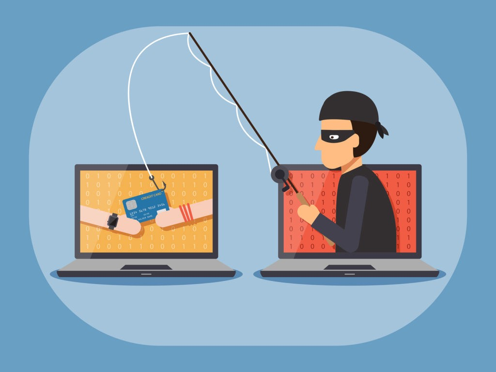
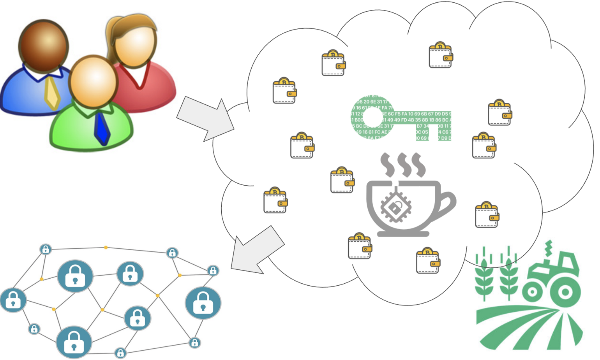

# 10 Unbelievable Facts of Gluon - a Decentralized Crypto Wallet

## Your private keys are not stored anywhere.

In the Blockchain world, your private key is everything. If you lose it, you lose everything forever. But if I tell you that even if Gluon doesn’t store your private key and you don’t have a copy of your private key nor mnemonic phrases, you can still have control over all your digital assets, would you believe it?

Nothing is impossible. If you continue reading, I’ll tell you how.

Your private key is split into N smaller pieces with K as the threshold using a cryptographic algorithm called Shamir Secret Sharing Schema (SSSS for short). No one can rebuild the original private key unless he collects K of N SSSS pieces. All those SSSS pieces are stored and distributed all over the TEA network by many TEA Nodes. Our TEA Consensus prevents any TEA node to host more than 1 (or another user defined number far less than K) SSSS pieces. Anyone outside of the hardware protected enclosure has zero knowledge about which pieces belong to which private key and which TEA node hosts which SSSS piece. The mapping information and SSSS pieces are encrypted and stored in the TEA node’s hardware protected secure RAM, never stored to any persistent storage (eg. hard disk or SSD), even after encryption.  

When you want to sign a blockchain transaction using this private key, it is required to pass 2 levels of authentication (not your grandpa’s 2FA). One of the two factors is a regular web extension used by Polkadot blockchain. Another factor is mobile phone authentication, which protected by either face-lock or fingerprint lock.

When Gluon layer 1 (a Substrate based blockchain) verifies your access, TEA Nodes will run a consensus to get K (K is the threshold number) pieces of SSSS to one randomly selected TEA Node (This node is called Executor). Inside this Executor, your original private key is reconstructed and used to sign your transaction. After that, the transaction is sent to your blockchain while the private key is wiped from the RAM as if nothing happened.

TEA Remote Attestation Consensus randomly selects Verifier TEA nodes to monitor the whole process and ensure the good behavior of all involved nodes. Suppose these verifiers cannot get a consensus on the security of the whole workflow. Not only will the signature not be sent, but all of the digital assets protected by this private key will also be transferred to other secure locations.

## We don’t have your private key and neither do you.

Because we are decentralized, it is common to say that we don’t have your private key, but neither do you. Forgive us when we say that we don’t believe you can protect your private key better than our decentralized trusted computing platform. If you have a copy of your private key or the mnemonic phrases to rebuild your private key, you’re at risk. The best solution is that no one has it.

Your next question is probably: What if something happens which causes the private key to get lost?

## Replicas everywhere and nowhere.

Like IPFS’s “pin” concept, TEA uses “repin” to let TEA Nodes host the SSSS pieces' unlimited replicas. Over time, any SSSS piece of your private key can have hundreds or thousands of replicas all over the TEA network. It is almost impossible to have all of them dead at the same time. And you do not need all N pieces available to rebuild your private key. K pieces are enough. You can define the K and N when you generate your private key. The K and N are basic parameters of the Shamir Secure Sharing Schema. Assume you set N = 10, K = 3, TEA will only need any 3 of the 10 pieces to rebuild your private key.

Since the replicas of the SSSS pieces are zero-knowledge to the outside world, no one will ever know which node stores which pieces of which private keys, so it is “nowhere.”

## Your assets are protected by 3 master keys hosted by you, Gluon, and your friends.

Your assets are protected by 2/3 multisig by default. You own one key (P1) and Gluon uses SSSS to protect the second key (P2).

Two of these three private keys can move your assets. In most cases, we use P1 and P2. P3 is only used for disaster recoveries which I will explain later.

Gluon will not access P1 because it is generated and stored in your Gluon mobile app which will never expose private keys to anyone. When I say “anyone” I mean everyone, including you and Gluon. Yes, you read that right! You don’t have the private key nor the mnemonic phrases of P1. Now, you may be asking: wait, what if I upgrade my phone? If I don’t have the mnemonic phrase, how can I restore my private key to my new phone?

## Got a new phone? Restore your private key even without the mnemonic phrase!

Most software/hardware crypto wallets require you as a user to write down mnemonic phrases for backup in case you need to restore a private key to a new wallet. It is your responsibility to keep those phrases in the same place. This sounds easy but actually very hard.

Gluon redesigns the workflow so that you can restore the private key to a new phone without using mnemonic phrases. Here’s what you need to do:

- Install the Gluon app on your new phone.
- Generate a new private key (New P1).
- Use your web browser (with Polkadot Extension) to login to the Gluon web portal. 
- Create a transfer key request in the Gluon web portal; a new QR code should show up on the web page.
- Scan this QR code on your new phone and confirm with your fingerprint. When you’re done, a new QR code will be displayed on your new phone.
- Use your old phone’s Gluon app to scan this QR code.
- Go through another fingerprint confirmation on your old phone.

You’re all set! Your old phone will no longer control your assets.

It’s so easy! No more writing down your secret on a piece of paper, or typing it down on a phone or keyboard. You may already know this, but typing on keyboards is one of the main sources of secrets leaking!

## I lost both my computer and phone, can I still recover my assets?

Lucky you’re using Gluon! If you were using other crypto wallets, you would have probably lost everything (unless you have backup mnemonic phrases…oh my God, I cannot remember where I hid it!)

Remember the P3 owned by your friends? This is the time for you to get your friends' help.

When you create your Gluon asset, you can select some of your friends to be your recovery contacts. You don’t have to tell them you chose them, but make sure you know them and can contact them in case of a disaster. You will need to create a new account on your new computer and phone and submit a “Recovery Request.” This is almost the same process as transfering to a new phone, the only difference is that you have to find some (the number is K) of your friends to scan the QR code on your new phone. As I mentioned in the K and N story, you don’t have to have all of your friends to scan, only K friends will do. But of course, you will need to be with them in person to run this recovery process and prevent any scams. GPS plays an important role here!

## Phishing your friends won’t work.

Phishing is the oldest and easiest low-tech scam, although it is still popular today. If a scammer knows who your recovery friends are, he could impersonate you to get your friends to sign the recovery request. To prevent this, we carefully designed our system.

We use zero-knowledge almost everywhere in our TEA project. To any outsiders, there is no way to know who all your recovery friends are. And even if they do, running a brutal hack of all the combinations won’t work. The signing sequence matters and only you know the sequences! We also have GPS to enforce a face-to-face scan, not to mention,k commonly used nonce and cryptographic algorithms are all built-in.

## Gluon is a TEA Project built on the T-rust framework; hacking TEA is expensive.

Please note that I use “expensive” and not “impossible” in the title. When we designed TEA, we knew we couldn’t build a security system that was completely impossible to break into, but we were able to make TEA too expensive to hack so that attackers won’t even try. This is the basic concept of blockchain security. I have another blog that explains this methodology so I don’t have to explain it here. 

In the beginning, TEA has fewer TEA Nodes running resulting in less security, but there are less valuable assets protected by TEA. When the assets protected by TEA grow, the TEA becomes larger, and more TEA nodes will be running consensus to protect each other. It is also much harder and expensive to attack. As long as we keep the successful hacking profit lower than the cost from the attacker’s point of view, you’re safe. TEA has many careful designs that address this financial balance. You can read my previous blogs for more information.

## Gluon is not a hardware wallet, it is many hardware wallets that can serve as a crypto wallet like Trust-as-a-Service

Hardware wallets are still the best way to protect your crypto assets (although Ledger recently got a data breach in the clients database). A TEA node can run other TEA Projects’ applications for different purposes. Technically when it runs the Gluon webassembly code, it becomes a hardware wallet. Furthermore, it does not work alone. There are hundreds if not thousands of other TEA nodes that work together to keep the TEA network safe and secure. The larger-scale TEA is, the safer it is.

## Gluon is not only a crypto wallet, it is also a portal of dApps and more.

Essentially, Gluon works as a decentralized crypto wallet service provider. Because it can hold all kinds of crypto assets, you can also use Gluon as your all-in-one assets manager just like 1Password or LastPass in the old Internet world. Since every blockchain-based dApp needs some kind of signature to join, Gluon is the perfect portal for them. You can run whatever dApp and use Gluon to sign in. There is so much more you can do with Gluon. Open your mind, and let your ideas fly, DeX, Defi, you name it! The sky's the limit.

We are still working on our GluonWallet website. In meantime, you can visit Teaproject.org (although it is also under construction) for more fundamental information on TeaProject, the T-rust framework, and Gluon Wallet. Please join us in the [Discussions](https://github.com/tearust/tea-docs/discussions) and be the first to share your ideas!

