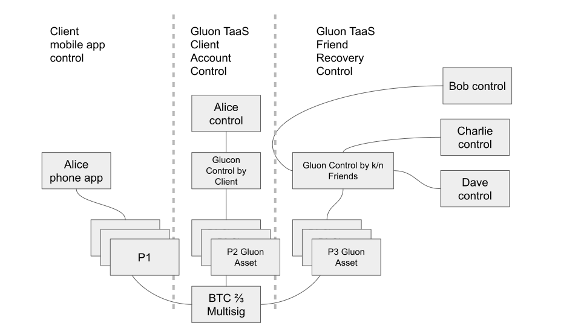
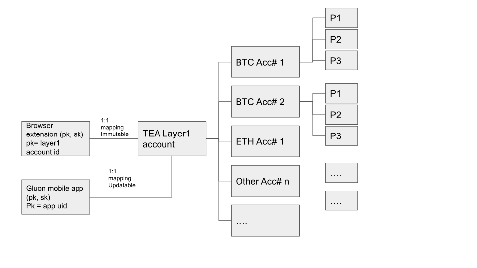
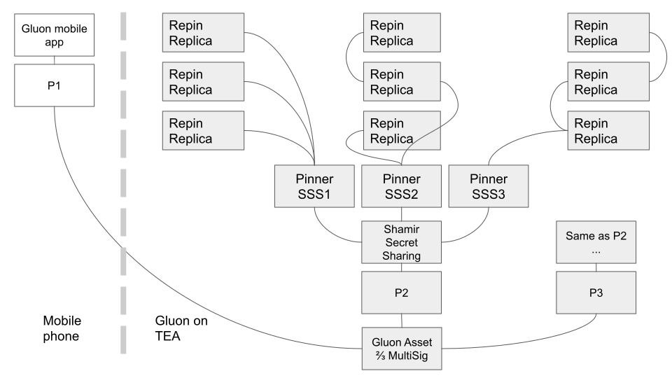
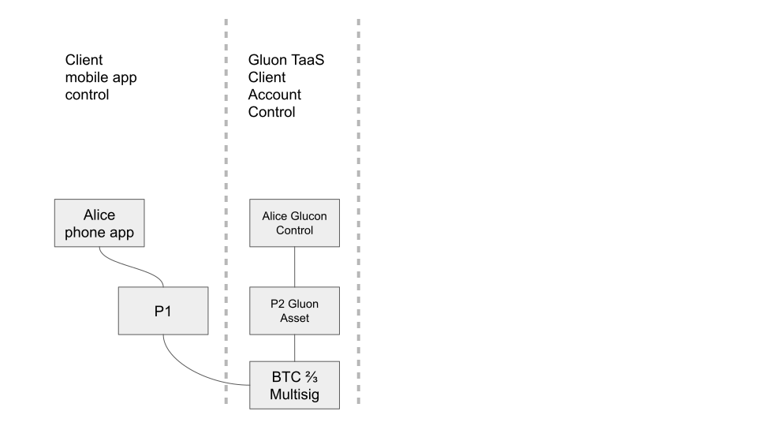
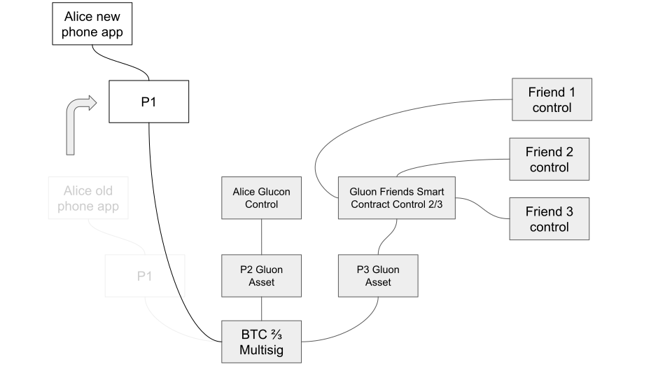
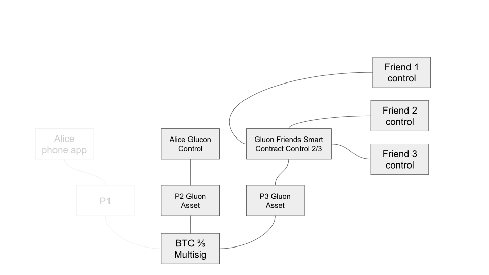
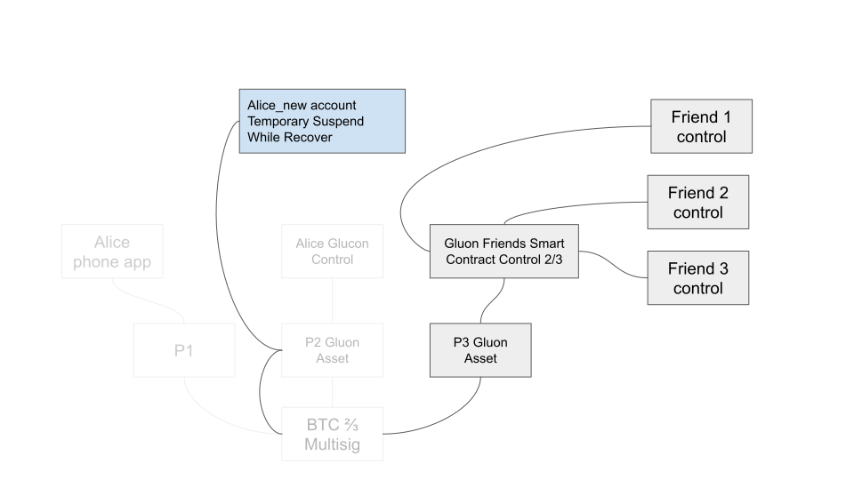

# Basic concepts

Let's assume Alice is our client. She is going to create a BTC wallet that managed by Gluon.
In order to get disaster recovery, she assign her three friends Bob, Charlie and Dave to be her recovery accounts.

Alice needs to have a TEA Layer1 plugin (Polkadot extension) on her browser. She also needs to install Gluon mobile app on her phone.

Gluon will create a 2/3 Multisig BTC account. The 3 keypairs are called P1, P2 and P3.

P1 secrete key is stored in Alice' phone app. The app can sign a tx using P1 sec key once fingerprint verification passed. Gluon won't have any copy of P1 secret key and have no access to P1. But Bluon can verify P1 signature from Alice' phone before allow P2 to sign.

P2 is managed by Gluon under Alice's browser extension control. Alice's browser extension can sign a "Sign Request" to Gluon layer1. Note: This Sign Request is not a signed tx. Alice's browser does NOT have P2. Alice' browser has a keypair (Gluon account login) to access Gluon layer1.  This is different than P2. the logic behind when to use P2 to sign tx is explained later.

P3 is managed by Cluon under Friend Recovery Smart Contract Control (FRSC). This is a simple threshold account verification. As long as 2/3 preset friends signed a "Recovery Request", the P3 is allowed to use to sign such a "Recovery Request". Note: P3 can only be used to sign "Recovery Request", not "Sign Request".

Because this BTC account is 2/3 Multisig. Any 2 of P1 P2 P3 can pass BTC's verification. The combinations are
- P1 + P2: For sign request. It is commonly used for any tx to transfer fund from Alice's BTC account
- P1 + P3: For recovery request. It is used when Alice lost or leak her browser extension account login secret. Use this combination to transfer all Alice's assets to her new created Gluon account. After a successful recovery, Alice' old gluon account will be disabled forever.
- P2 + P3: For recovery request. It is used when Alice lost or leak her phone Gluon App secret. Use this combination to transfer all Alice's assets to her new created Gluon account. After a successful recovery, Alice' old phone gluon app will be disabled forever.

## Relationship and mapping

Every user has two factors to authenticate. One is Browser extension, another is mobile app. The browser extension does't have to be an extension. It could be any kind of popluar software or hardware wallets that support Polkadot account system. We use extension for easy explaining. Please do not get limited by the name yet.

The Gluon mobile app is a Gluon build application, it has more security features than a regular software mobile wallet. So it cannot be replaced with other Polkadot compatible wallet.

The browser extension's public key is the user's TEA layer1 account ID. TEA Layer1 (it is also Gluon layer1) verify the signature of extension sec key to authenticate the request from browser. 

Because the browser extension lack of 2FA as mobile apps do, we use the Gluon mobile app as an important additional authentication factor to any request from browser. That means any request from browser cannot be authenticated only by veriifying signature of layer1 sec key( browser extension sec key). It has to get mobile app's signature to continue.

Because the extension pub key is the same as TEA layer 1, you cannot change browser pub/sec key. If you lost or leak the sec key, you may need to create a new TEA layer1 account then use Recovery Request to transfer all your assets to the new account while disable old account.

However, the mobile app pub key is just a mapping to TEA Layer1 account, so you can update the mobile app's pub key. It comes handy is you frequently upgrade your phone. We designed a Transfer Between Phone workflow for this. It is easy and secure.

The TEA layer1 ID is the single ID to Gluon Wallet. You can have as many as you want crypto accounts inside the single wallet. So this is a 1-to-many mapping. All accounts are an "asset" in layer1. When transfer those assets from one Layer1 account to another layer1 account is easy without transferring the money inside those account. It is as easy as remapping. Of course, the remapping is under control of the smart contract so protect stealth. 

Every asset need to be a 2/3 multisig account. It contains 3 private keys, we call them P1, P2, P3. 

Every private key of P1/P2/P3 is not stored anywhere in the world. They are splitted into Shamir Secret Sharring pieces. Those pieces are repinned by many replica pinners. 

See the diagram below, the Gluon Asset is a Private Key like P1 for example. 

Any Gluon Asset (for example a 2/3 MultiSig BTC account) has 3 keys, P1, P2 and P3. P1 is managed by client's mobile app. Gluon services won't access to P1 at all. 
P2 and P3 are managed by Gluon services. In this digram we use P2 as an example. P3 is exactly the same as P2.

P2 is splitted to 3 pieces using Shamir Secret Sharing Schema. Those 3 pieces are SSSKey1, SSSKey 2, SSSKey3. We use the number 3 for example. it could be any number. Use need to speicify this number as N. Another number is K, which means how many pieces are required to rebuild the orignal P2. In our exmaple, we use K= 2, N = 3. So this is a 2/3 Shamir Secure Sharring. In the real world, we should use much larger number for security reasons.

Each SSSKey are repinned by other pinners, those are called replica. They are exactly the same. We are repinned just for redundant reason. We do not want to lose all of them at any moment. In our diagram we draw 3 replicas for example. It could be a very large number.

When reconstructing P2, we use the typical TEA discovery algorithm to find any replica from each SSSKey tree. As long as we get 2 SSSKeys, we can reconstruct the P2.

As long as we have two of three (P1, P2, P3), we can multi sign the BTC transaction. 

# Workflows

## Alice register Gluon wallet account

Question: Should we use RSA key in mobile app? I think we should use ECC instead. 

```puml
@startuml
autonumber
box
actor Alice
actor AliceBrowser
actor AliceGluonApp
endbox
box
actor TeaLayer1
actor GluonLayer2
endbox
Alice -> AliceGluonApp: Download APP and install on her phone.
AliceGluonApp -> AliceGluonApp: Generate RSA keypair. Pub key as AppPubKey. App store AppSecKey in a secrete place

Alice -> AliceBrowser: Download and install Polkadot Extension. Create a new account of TEA Layer1.

AliceBrowser -> AliceBrowser: Start pairing mode. Generate a random nonce at Browser (or extension) in QR code format. 
note right
The QR code include
- Nonce
- Alice browser's public key. Also called Alice's layer1 account ID, or just accountID.
- Signature on Nonce using Alice accountID
end note

AliceBrowser -> TeaLayer1: Send the hashed nonce to layer1. 

TeaLayer1 -> TeaLayer1: Stored the hashed nonce in Alice account info map. This hashed nonce is for temporary use to verify mobile phone app. So it may timeout and removed. 

AliceBrowser -> AliceGluonApp: Alice use AliceGluonApp's camera to scan such a QR code got the nonce and AliceBrowser's public key (this is Alice layer1 account ID). Verify sig

AliceGluonApp -> TeaLayer1: Send registration application 
note right
including: 
- nonce, 
- AppPubKey, 
- Alice Browser public key received from QR code(this is also Alice's accountID)
- Signature of nonce using AppSecKey
end note

AliceGluonApp -> AliceGluonApp: Store the browser extension public key (TEA Layer1 account id). this account ID would be used for all verification in the future

TeaLayer1 -> TeaLayer1: Verify sig, Hash the nonce, then compare with stored hashed nonce in Alice' account info map previous stored from Browser request.
note right
If hash does't match. Drop this request. Someone is trying to imperson Alice's phone.
If match, store AppPubKey to Alice's account info map. Use this pubkey for future communication mobile app verification
The nonce is for one-time-use. It can be removed from layer1 storage now.
end note

AliceBrowser -> TeaLayer1 : Query updated account information. 
note right
We should see a mobile app has been paired with Alice's account. The AppPubKey is shown.
If possible, browser can also listen to the layer1 event so that it know when the pairing process completed.
end note
AliceGluonApp -> TeaLayer1: Query updated account information. Confirm successfully paired.
@enduml
```

Only one mobile app can be paired with Alice's account at any time. If Alice want to update her phone, she need to run the Transfer task to assign new phone and disable old phone.

Once Alice' mobile app is paired with Alice' account. Only Alice's mobile app can send message to both Gluon layer1 and layer2. Everytime Gluon will use a nonce to verify AppPubKey signature to prevent man in the middle attack. This is common practice, so we will not mention in our workflow.

## Generate BTC 2/3 MultiSig Account

```puml
@startuml
autonumber
box
actor Alice
actor AliceBrowser
actor AliceGluonApp
endbox
box
actor TeaLayer1
actor GluonLayer2
endbox
=== Alice submit Generate BTC Account task request ===

Alice -> AliceBrowser: Go to Gluon client app webpage. Run Generate BTC Account task in AliceBrowser. This task is "GenerateBTCRequest"
Alice -> AliceBrowser: Enter task detail
note right
Include:
- What cryptocurrency account you are going to generate? BTC, ETH or ...?
- Shamir k/n K=? N=?
- Recovery friend public key list
- The threshold of friend recovery. how many freinds signature can covery your assets?
- Allow Friend Recovery? by default yes
- Allow mobile phone app transfer? by default yes
- Signature of task using Layer1 account ID (extension pub key)
Automatic calculate the gas limit based on the information above.
end note

AliceBrowser -> AliceBrowser: Create a QR code with information: task_name: GenerateBTC, nonce: 1234(random number)

AliceBrowser -> TeaLayer1: Hashed nonce, Hash of the task detail, signature of this task.
note right
Here we do not send the full detail of the task, just the hash of the task detail.
the purpose is to verify the task detail from the mobile app. Since the mobile app will send the detail anyway.
We trust mobile phone more than web because the mobile app has fingerprint sensor.
When mobile app send task to the layer1. Layer1 will hash the task detail and compare with the hashOfTask from browser.
end note

TeaLayer1 -> TeaLayer1: Verify sig. Store hashed nonce for one-time-verification use. Temporary. Hash of the task detail. Temporary.

AliceGluonApp <- AliceBrowser: Alice use mobile app to scan the QR code. Use fingerprint to confirm.
note right
This is the best time for Alice to review the task detail. Make sure that all the information are correct before fingerprint confirmation. 
end note

AliceBrowser -> TeaLayer1: Send confirmation including: nonce, signed nonce using AppSecKey, task full detail.

TeaLayer1 -> TeaLayer1: Verify 1. AppPubKey verify signature 2. Hash the nonce compare with Browser uploaded hashed nonce. Hash of task detail matches browser update too.

TeaLayer1 -> TeaLayer1: Generate a Generate BTC task on behalf of Alice

== Generate BTC Account ==


@enduml
```
## In common usage cases

In common usage, only P1 and P2 are used to sign a transaction.

Typically Alice can start a transaction from a web browser.  

Alice use her browser's Polakdot Extension to sign a signature request (SigReq) of this transaction. Note: This is a Signature Request sending to Gluon, not a signature of this transaction. The signature request doesn't contain full transaction but a hash of the transaction. The full transaction will be sent from Alice mobile phone Gluon app. Gluon receives this SigReq, save the hash of task detail it in Task Pool but not continue until P1 (Mobile app) to sign the transaction first. 

Once the transaction reuqest is sent to layer1, the web browser shows a QR code. Alice need to use her phone Gluon app to scan this QR code.

Gluon app will show the detail of transaction, in our case "Sending $100 to Eve). Alice re-confirm the transaction then click sign. Alice's mobile phone has P1 secret so that the app can sign this transaction. P1 is completed. This P1 signature also send to Gluon. Gluon received P1 Signature and verify. If this signature from a registered phone all and verify successfully, Gluon will conintue to get P2 signature using Sharmir Secret Sharing Schema. Once P2 is signed, both signature send to BTC.
b

```puml
@startuml
autonumber
box
actor Alice
actor AliceBrowser
actor AliceGluonApp
endbox
box
actor TeaLayer1
actor GluonLayer2
endbox

actor BTC

Alice -> AliceBrowser: Create a tx
AliceBrowser -> TeaLayer1: Request Gluon to sign using P2
AliceBrowser -> AliceBrowser: Show QR code on screen waiting for Alice GluonApp to scan
note right
QR code include information
- task detail
- nonce
- signature
end note

TeaLayer1 -> TeaLayer1: Verify AliceBrowser P2; Create SigReq task
AliceGluonApp -> AliceGluonApp: Scan QR code to show tx detail on mobile screen. Request Alice to confirm using fingerprint
Alice -> AliceGluonApp: Confirm by unlock fingerprint
AliceGluonApp -> TeaLayer1: Signature of Tx using P1
TeaLayer1 -> TeaLayer1: Verify Signature from AliceGluonApp
TeaLayer1 -> GluonLayer2: If pass, emit an event to request delegator.
GluonLayer2 -> TeaLayer1: Some delegator apply to be an delegator of this task  
note right
the task comes with a CapChecker. All wannabe-delegator can check if it is capable to apply first.
eg. a BTC generation task requires a BTC related crypto algo providers to be loaded
for those who doesn't have such a provider, won't apply
end note

TeaLayer1 -> TeaLayer1: Random to select one delegator, and create nonce and encrypt it using the selected delegator pubKey. 
TeaLayer1 -> GluonLayer2: emit event with encrypted nonce and start P2 signature process (SSS) 
note right
the hash of this nonce is stored in the block with the task
so that other pinners (who hosts SSSS pieces) can verify if this executor is actually the winner.
Only give the SSSS pieces to the real winner. 
Anyone who is trying to impersonate the winner will get punished
end note

GluonLayer2 -> GluonLayer2: delgator try to decrypt the nonce, and deal with the task.
note right
Every wannabe delegator can try to decrypt, but only those selected can, others will fail.
In this case, other wannabe knows it is not selected, but still has zero knowledge on who is selected, only the winner knows
end note
GluonLayer2 -> BTC: Send 2 signature satisfied 2/3 MultiSig
GluonLayer2 -> TeaLayer1: Update the task result to finished with nonce
TeaLayer1 -> TeaLayer1: Hash the nonce from delegator and compare it with original nonce hash. If pass record the result.
@enduml
```

## Transfer the P1 to a new phone

We do not recommended our client to backup mnemonic passphrase. If client cannot manage the mnemonic correctly, it may cause secret leaking. Although if Alice leak P1 only may not cause any asset loss, it increase the risk since there is only P2 or P3 to protect her assets. However, we allow client to upgrade there phone so that the secret can be transferred from old phone to new phone at a much lower risk. That means a one-time display mnemonic. 

In order to discourage Alice display and backup her mnemonic, we would force Alice to install Gluon app on her new phone before she can display mnemonic on her old phone. When new phone registered successful, Gluon will allow old app show the mneonic in text or QR code once. At this same time, revoke old app's registration. Any new transaction sent from old app won't be accepted. 

Alice can use her new phone's Gluon app to scan the QR code immediately. New Gluon app will recover the P1 secret. Once done, sending successful signal to Gluon. Gluon will request old Gluon app to destroy secret also disable its access forever. Any information sending from the old app won't be accepted from now on.

Alice needs to be very careful when transfer P1 from old phone to new phone. She needs to make sure no one can see the QR code or mnemoonic during the transfer. 

```puml
@startuml
autonumber
box
actor Alice
actor AliceBrowser
actor OldAliceGluonApp
actor NewAliceGluonApp
endbox
box
actor TeaLayer1
actor GluonLayer2
endbox

Alice -> NewAliceGluonApp: Download and install GluonApp to Alice's new phone. Generate new AppPubKey AppSecKey
NewAliceGluonApp -> TeaLayer1: Generate a random nonce; Submit a transfer p1 request 
note right
including:
- AppPubKey of the new app
- Hash of Random nonce
- signature of nonce using AppSecKey
end note

TeaLayer1 -> GluonLayer2: Execute transfer task
OldAliceGluonApp -> GluonLayer2: Alice start old app and old app contact to backend Query
GluonLayer2 -> OldAliceGluonApp: Notify Alice that you have a new phone asking to transfer p1 from the current phone
NewAliceGluonApp -> Alice: Show the QR code of nonce
Alice -> OldAliceGluonApp: Scan the QR code on New Phone screen, the nonce enter old phone.
OldAliceGluonApp -> OldAliceGluonApp: Show the notice, let Alice fingerprint confirmation. 
OldAliceGluonApp -> GluonLayer2: Send hashed nonce, waiting for confirmation
GluonLayer2 -> GluonLayer2: Verify hash of nonce. If match, Generate a temp AES key.
GluonLayer2 -> OldAliceGluonApp: Confirm the hash matches. Including the AES key
GluonLayer2 -> NewAliceGluonApp: Confirm pairing OK. Notification including the AES key.
OldAliceGluonApp -> Alice: Show P1's QR code. The QR code is AES encrypted private key
Alice -> NewAliceGluonApp: Using new phone to scan old phone's QR code. Decrypt the private key using AES key from GluonLayer2.
NewAliceGluonApp -> NewAliceGluonApp: Store the P1 into secured place. 
NewAliceGluonApp -> GluonLayer2: Send notification of successful transfer.
GluonLayer2 -> TeaLayer1: Replace OldAliceGluonApp's AppPubKey with NewAliceGluonApp's AppPubKey. From now on, only new app can communite with Gluon
GluonLayer2 -> OldAliceGluonApp: Destory P1 and wipe out memory. Stop screen display. Disable everything
GluonLayer2 -> NewAliceGluonApp: Confirm transfer successfully.

@enduml
```

## If Alice lost both her phone and computer (p1 and p2)

The FRSC (Friend Recovery Smart Contract) controlled P3 is only used when Alice lost her phone AND her layer1 account secret key. Alice is lucky, this is just because she lost the key, not leaking. No one have both her P1 and P2 yet. If someone have her P1 and P2, he can take over Alice's assets.

This is a very rare case and if this happened in other blockchain projects, this could mean that Alice will lose her assets forever. But we can still use Friend recovery to get the P2 back to her new generated layer1 account, so that her assets are saved.

# Replica and Shamir Secret Sharing

 
