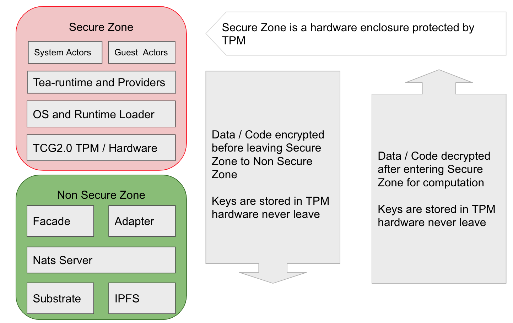

# TEA vs Trusted Computing

T-rust (or TEA-rust) is all about **Trust** on a remote node that you do not know where it is located, who owns it, what is loaded in the memory and if the hardware/software config is actually what the owner claimed.

The ultimate solution is a cryptographic solution that you do not need to worry about all of these. There are some existing software solution, such as [FHE](https://en.wikipedia.org/wiki/Homomorphic_encryption) and [SMPC](https://en.wikipedia.org/wiki/Secure_multi-party_computation). However, they are not the topics we discuss today. All of them comes with a huge computational cost. To be practical, we focus on hardware solution only.

Hardware solution means the code and data actually run on a remote TEA node that protected by hardware. The hardware either can provide PoT (proof of trust) for remote attestation, and/or, the hardware protected the code and data in a highly secured area called "enclave". The former is typically called TPM/HSM; the latter is generally called TEE.

## TPM and HSM
All these questions need to be done by a remote attestation process. However remote attestation needs **evidence(PoT)** to verify against **claim**. The claims can easily query from the blockchain. But how about evidence? How do you know the proof coming from another node is the truth?

This is one of the problems Trusted Computing needs to solve. Another one is [Data in use](https://en.wikipedia.org/wiki/Data_in_use#Enclaves) to be solved by TEE enclave in the next section.

The TEA nodes logically split into two areas. The secure area in red and non-secure area in green. The non-secure area is not protected, so any sensitive data need to be encrypted if ever live in this area. The secure area is protected so that it is OK to be decrypted to clear data inside. The computation happens inside the secure area in plain data so that it runs in native speed as no FHE or SMPC needed. 

In TEA project, we use typical TCG 2.0 technical stack such as Measured Boot. 

TCG 2.0 is a complicated system, I cannot explain in detail here. You can easily get more information by reading TCG 2.0 standard [documents](https://trustedcomputinggroup.org/resource/tpm-library-specification/). Another good learning resource is [Google's TPM-js project](https://google.github.io/tpm-js/). 

The PCR stack values are published to the blockchain during the booting process along with its claim. So that any other TEA nodes can get this node's PCR stack, by regenerating the PCR stack from the claim, any other TEA nodes can verify if this TEA node's claim matches the truth. This is one essential feature TEA uses for remote attestation. Besides this feature, we also use VRF to select multiple remote attestation nodes as a [BFT](https://en.wikipedia.org/wiki/Byzantine_fault) committee to make the group decision. 

## TEE

TEE is a very different approach. It makes the protected area even smaller, into a small part of the RAM and inside CPU chip. We can use Intel SGX as an example.

All sensitive data is decrypted and processed inside the small area called **enclave**. Even the OS has no access to it because the encryption key is inside the CPU hardware. In this case, the trust and protection come from the CPU manufacturer. In most cases, we have to trust the CPU although there are a few vulnerabilities found. 

Given the trust comes from the CPU manufacturer, the remote attestation is easier since it is centralized—the difficulties transferred to the dApp developers. Due to limited resources inside the enclave, the developers need to figure out which function runs inside enclave to gain security as well as which function runs outside of enclave to gain performance. Security and performance is always a trade-off.  

## When to use TPM, when to use TEE?

T-rust supports both TPM/HSM and TEE solutions as the source of trust. Which solution a TEA node to choose depends on the specific use case.

Not all CPU has TEE feature. Some special-purpose computer uses special chips that may not be a general-purpose CPU. For example, AI requires GPU or TPU rather than CPU. Smaller low power IoT device may use low power CPUs do not support TEE. in those exceptional cases, TPM/HSM is the best solution.

On the other hand, a general-purpose computer usually equipped with x86 / ARM CPU which either support Intel SGX / AMD-TEE or ARM Trustzone. Most of these machines also have built-in TPM. So a combination can be used in this case. 

No matter which solution TEA nodes choose, the majority workflow is the same. The only differences are the remote attestation workflow and how the wasm code loaded into CPU. 

When a client submits a computation task, he can claim the requirement in the description JSON file. For example, this task is an AI task, a TPU is required. The Capability-checker will ensure only capable TEA nodes "hosts" this dApp and execute the code.

